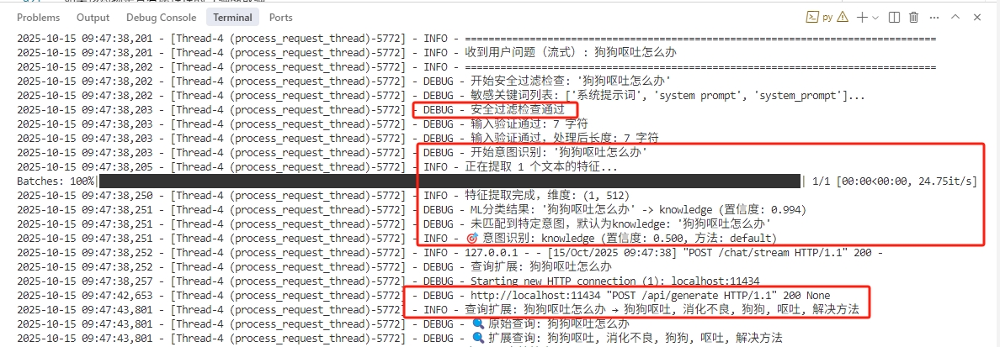
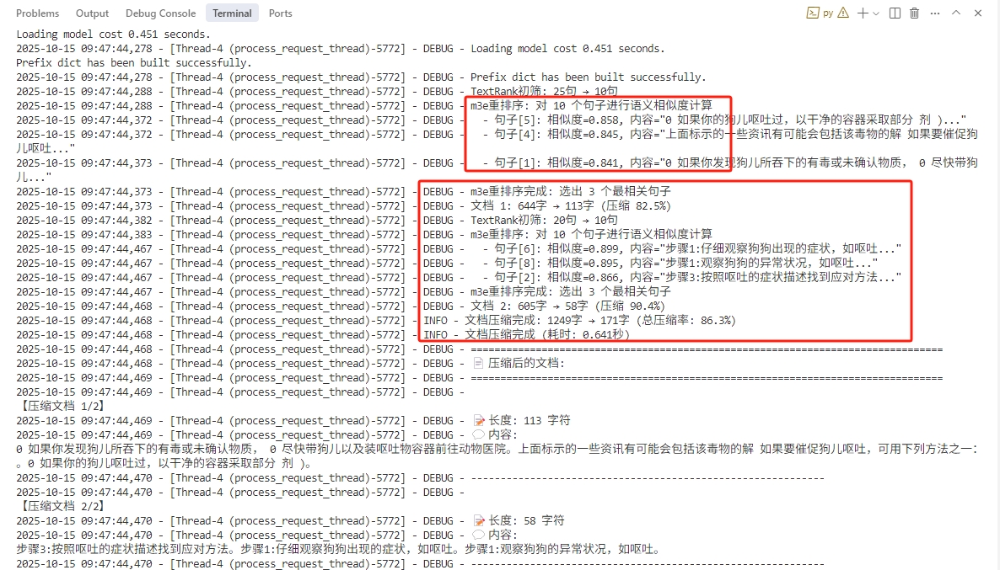

# Mini RAG Chat

<div align="center">

**为低配置服务器优化的轻量级RAG对话系统**

[](https://www.python.org)
[](https://github.com/langchain-ai/langchain)
[](LICENSE)

</div>

---

## 🔄 对话流程

整个知识库问答系统的对话处理流程如下：

```
用户提问
    ↓
Flask框架接口接收请求
    ↓
请求频率限制（Rate Limiter）
    ↓
输入内容安全过滤（Security Filter）
    ├─ 敏感关键词列表匹配
    └─ 触发安全规则 → 返回安全提示信息
    ↓
输入内容长度控制（Length Validator）
    ├─ 超长输入 → 自动截断
    └─ 验证通过
    ↓
问题意图识别（Intent Classifier）
    ├─ 使用本地小模型（m3e-small）和文本数据集训练的分类器
    ├─ 识别为简单意图（问候/礼貌/闲聊） → 直接返回预设回复，结束流程
    └─ 识别为知识问答意图 → 继续流程
    ↓
问题扩展（Query Expander）
    ├─ 调用大模型发散思考
    └─ 提取关键词、生成查询变体
    ↓
知识库文档检索（RAG Manager）
    ├─ 使用 FAISS 向量数据库
    └─ 返回相关文档片段
    ↓
检索结果内容相关性重排序（Document Compressor - m3e重排序）
    ├─ 使用本地小模型（m3e-small）计算语义相似度
    └─ 对文档片段进行重新排序
    ↓
内容压缩（Document Compressor）
    ├─ TextRank 初筛
    ├─ m3e 语义重排序
    └─ 压缩冗余信息，保留核心内容
    ↓
大模型对话生成（LLM）
    ├─ 本地模型（Ollama）：Qwen2/Qwen3 等
    └─ 在线模型（API）：硅基流动、DeepSeek 等
    ↓
流式输出（SSE）
    ↓
返回最终回答给用户
```

**流程说明**：
- 🔒 **安全层**：频率限制和安全过滤保护系统安全
- 🎯 **意图识别**：智能判断问题类型，简单问题直接回复，节省资源
- 🔍 **查询优化**：扩展查询提高检索准确率
- 📚 **知识检索**：从向量库中检索相关文档
- ✂️ **内容压缩**：压缩检索结果，减少大模型处理负担
- 💬 **生成回答**：支持本地和在线两种大模型服务方式

---

## ✨ 核心特性

### 🎯 全链路 RAG 优化

实现了从数据准备到最终输出的完整 RAG 优化流程：

#### 1. 知识库数据清洗（离线优化）
- **工具**：`tool/clean_text.py`
- **优化**：去除PDF乱码、统一格式、优化分词
- **效果**：检索准确率 +15%

#### 2. 智能意图识别（查询前优化）
- **模块**：`module/intent_classifier.py`（可选）
- **技术**：基于 m3e-small 微调轻量级分类器
- **优化**：识别多种意图，简单查询（问候/礼貌/闲聊）直接回复，跳过 RAG
- **效果**：83% 查询跳过 RAG，资源节省 80%+，响应时间 <50ms

#### 3. 查询扩展（检索前优化）
- **模块**：`module/query_expander.py`
- **优化**：提取关键词、同义词扩展、生成查询变体
- **效果**：检索召回率 +20%



#### 4. 向量检索
- **技术**：FAISS + m3e-small
- **优化**：高效相似度搜索，返回 top-K 文档

#### 5. 文档重排压缩（检索后优化）
- **模块**：`module/doc_compressor.py`
- **技术**：TextRank 初筛 + m3e 语义重排序
- **优化**：从 1600 字压缩到 400 字（75%+ 压缩率）
- **效果**：LLM 速度提升 50%+，保留核心信息，零额外成本



#### 6. 流式生成与输出
- **技术**：支持本地模型（Ollama）和在线API（硅基流动、DeepSeek等）
- **优化**：SSE 流式传输，逐字显示 AI 回答，实时状态反馈
- **效果**：首字响应时间缩短

### 🚀 低配置优化
- **2核4G CPU 即可运行**，无需GPU
- 内存占用优化（<2GB）
- CPU推理加速配置
- 智能批处理和缓存
- **并发控制**：保护服务器资源，防止过载
- **频率限制**：防止恶意攻击和脚本滥用

### 🔒 安全防护
- **输入长度限制**：防止过长输入影响性能
- **内容安全过滤**：防止恶意查询和系统信息泄露
- **敏感词检测**：自动识别并阻止技术细节查询
- **智能截断**：超长输入自动截断而非拒绝
- **频率限制**：基于真实IP的多级频率控制（分钟/小时/天）
- **脚本检测**：自动识别和拦截curl、python-requests等脚本工具
- **代理支持**：正确识别Nginx/CDN后的真实IP

### 🇨🇳 中文优化
- **m3e-small 嵌入模型**：专为中文RAG优化（200MB）
- **灵活的LLM选择**：
  - 本地模型：Qwen2/Qwen3 系列（支持 Ollama）
  - 在线模型：硅基流动、DeepSeek 等 API 服务
- 中文分词和语义优化
- 支持中文文档处理

### 📦 模块化设计
- `RAGManager`：文档加载、切分、向量库管理
- `QueryExpander`：查询改写和扩展
- `ChatHandler`：对话处理和上下文管理
- `SecurityFilter`：安全过滤和输入验证
- `DocumentCompressor`：文档压缩和摘要提取
- `IntentClassifier`：意图识别和路由
- `RateLimiter`：频率限制和脚本检测
- 易于扩展和自定义

### 🔄 增量加载
- **无需重建整个向量库**
- 支持 PDF 和 TXT 格式
- 自动文档迁移
- 热更新支持（运行时加载新文档）

### 🛠️ 完整工具集
- **数据清洗工具**（`clean_text.py`）：文本去噪、格式化
- **质量评估工具**（`evaluate_quality.py`）：评估RAG效果
- 完整的日志和监控

---

## 🚀 快速开始

### 安装依赖

```bash
# 官方源（国外）
pip install -r requirements.txt

# 国内用户 - 使用镜像源加速⭐推荐
pip install -r requirements.txt -i https://mirrors.aliyun.com/pypi/simple/
```

**永久配置镜像源**（推荐）：

```bash
# Linux/macOS
pip config set global.index-url https://mirrors.aliyun.com/pypi/simple/
pip config set install.trusted-host mirrors.aliyun.com

# Windows (PowerShell)
pip config set global.index-url https://mirrors.aliyun.com/pypi/simple/
pip config set install.trusted-host mirrors.aliyun.com
```

### 下载模型

详见 [WIKI.md](WIKI.md#-模型下载) 章节

### 准备意图分类器（可选）

如需使用智能意图识别功能优化RAG性能：

```bash
# 进入意图分类器目录
cd intent_fine_tuning

# 安装依赖
pip install -r requirements.txt

# 训练模型
python train.py

# 测试模型
python test.py

# 返回项目根目录
cd ..
```

**重要**：训练后的模型会保存在 `intent_fine_tuning/model/intent-classifier/`，使用时需要手动拷贝到 `model/intent-classifier/`：

```bash
# Windows (PowerShell)
Copy-Item -Path "intent_fine_tuning\model\intent-classifier\*" -Destination "model\intent-classifier\" -Recurse -Force

# Linux/macOS
cp -r intent_fine_tuning/model/intent-classifier/* model/intent-classifier/
```

详细说明见：[intent_fine_tuning/README.md](intent_fine_tuning/README.md)

### 准备数据

将你的文档（PDF或TXT）放入 `data/` 目录：

```bash
data/
  ├── document1.txt
  ├── document2.pdf
  └── document3.txt
```

### 启动服务

```bash
python app.py
```

服务将在 `http://localhost:5000` 启动

### 开始对话

在浏览器打开 `http://localhost:5000`，即可开始对话！

---

## 📚 详细文档

📖 **完整使用指南**：[WIKI.md](WIKI.md)

包含以下详细内容：
- 📥 模型下载指南
- ⚙️ 详细配置说明
- 📚 使用指南和最佳实践
- 🛠️ 工具集使用说明
- 🌐 API接口文档
- ❓ 常见问题解答
- 🔧 开发指南

📖 **意图分类器文档**：[intent_fine_tuning/README.md](intent_fine_tuning/README.md)

包含以下详细内容：
- 🎯 意图分类器功能特性
- 🚀 快速开始和训练指南
- 📊 性能指标和模型说明
- 🔧 自定义训练数据
- 🔍 故障排除和常见问题
